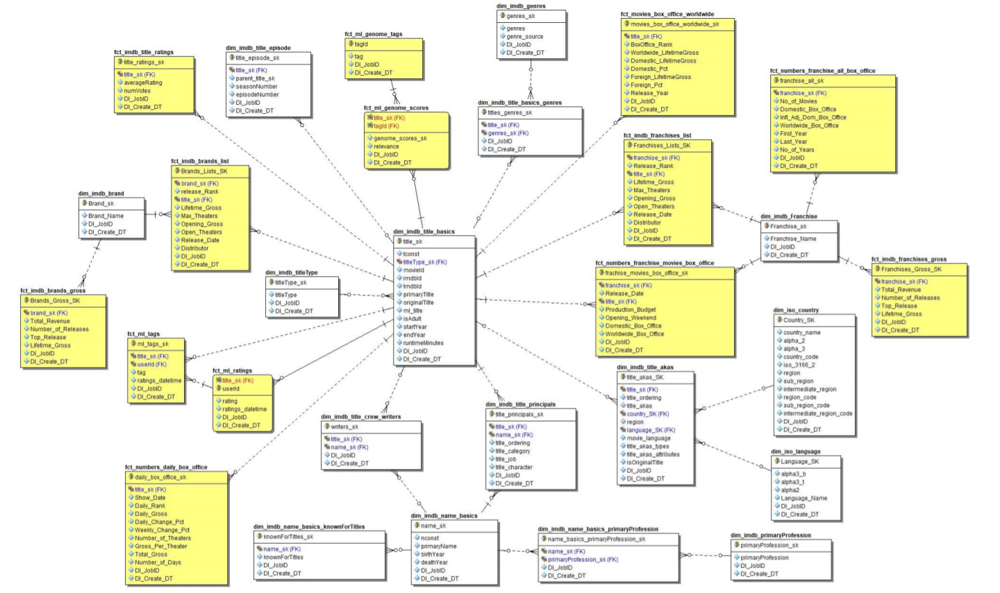
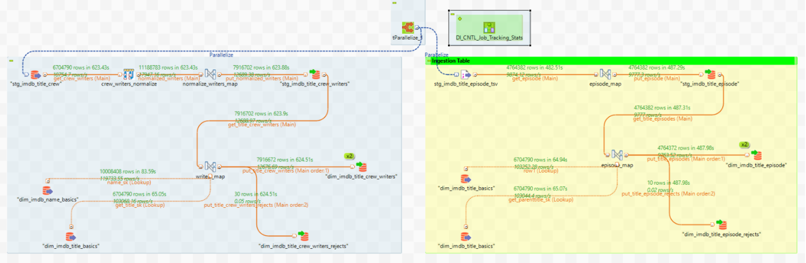
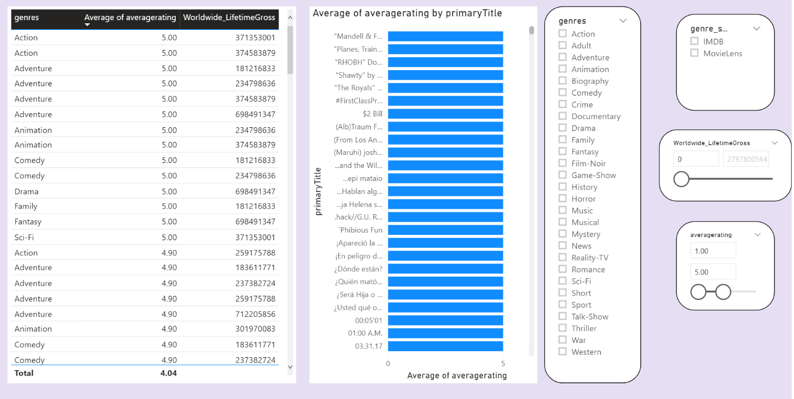
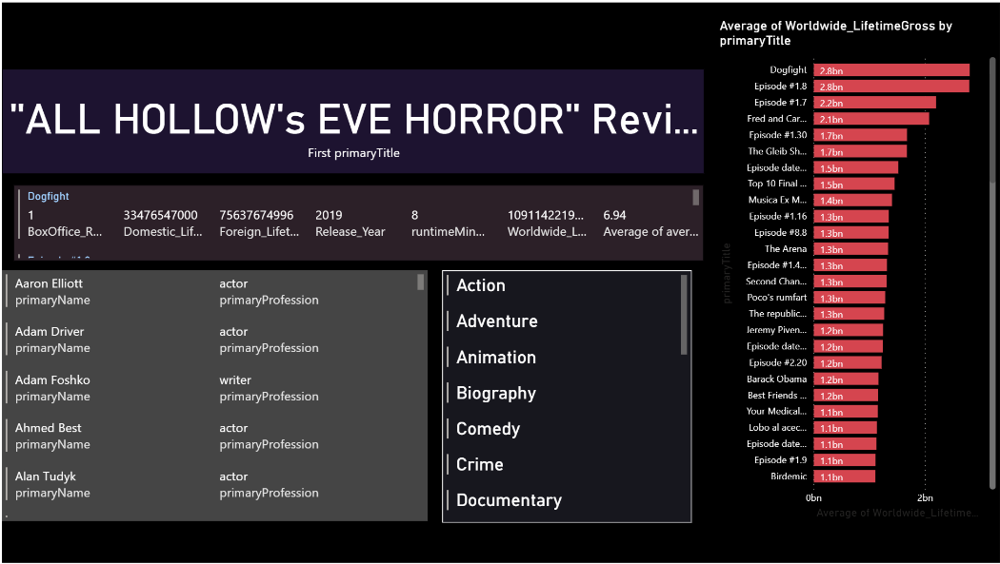
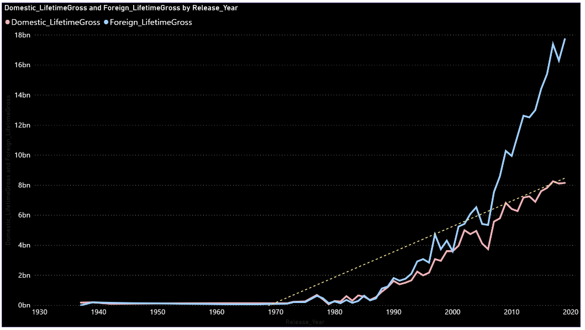
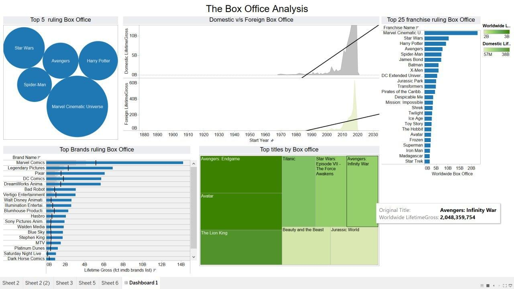

# IMDB-Movie-Analytics-and-Business-Intelligence

## Tools Utilized
These are the tools I have utilized for the following project:
* Microsoft PowerBI 
* Microsoft SQL server Management Studio
* SQL Server Developer Edition
* Tableau
* Talend Real-Time Data Platform 7.1

## Steps of the project:

### 1. Run the following scripts in SQL Server Management Studio to setup the staging database

* The Number - stage tables.sql
* stg imdb tables - core tables.sql
* stg imdb tables expanded part 2.sql
* stg_ml_tables.sql

### 2. Open Talend and setup your database connections and input file connections

### 3. After the connections successfully established, you can run the final job
*Note: the run time may take about 75 minutes.*
 

# Data Warehouse using ER Studio

# Talend Jobs Sample

# PowerBI Jobs Sample

# Tableau Jobs Sample

